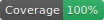

<!--

This file was written by 'MakeMarkdown.php' line 32 using
SchenkeIo\PackagingTools\Markdown\MarkdownAssembler

Do not edit manually as it will be overwritten.

-->
# Laravel Auth Router

 Social Login made easy


[](https://github.com/schenke-io/laravel-auth-router/actions/workflows/%3Arun-test.yml%3Amain)
[](https://packagist.org/packages/schenke-io/laravel-auth-router)
[](https://packagist.org/packages/schenke-io/laravel-auth-router)
[]()
[]()


Introduction


* [Laravel Auth Router](#laravel-auth-router)
  * [Installation](#installation)
  * [Basic concept](#basic-concept)
  * [Example Google login](#example-google-login)
  * [Advanced Example](#advanced-example)
  * [Name conflicts](#name-conflicts)
* [Providers](#providers)
  * [Amazon Provider](#amazon-provider)
  * [Google Provider](#google-provider)
  * [Linkedin Provider](#linkedin-provider)
  * [Microsoft Provider](#microsoft-provider)
  * [Paypal Provider](#paypal-provider)
  * [Auth0 Provider](#auth0-provider)
  * [Facebook Provider](#facebook-provider)
  * [Stripe Provider](#stripe-provider)


## Installation

Install the package with composer:

```bash
  composer require schenke-io/laravel-auth-router
```

## Basic concept

This package is based on Socialite and is configured in a similar way. For each Login
you configure the keys in `config/services.php`.

In the routes/web.php file you add the Route helper `authRouter` to say which providers
you want to user and how 3 main routes are named in your application.

```php
Route::authRouter(/* provider/s */, $routeSuccess, $routeError, $routeHome, $canAddUsers);
```

| Parameter    | Definition                                                              | Examples                              |
|--------------|-------------------------------------------------------------------------|---------------------------------------|
| provider     | name of the social login providers, single string or array of strings   | 'google'  _or_ ['google','microsoft'] |
| routeSuccess | route after successful login                                            | 'dashboard'                           |
| routeError   | route after login failure, should be able to display errors as feedback | 'error'                               |
| routeHome    | route to a non protected view                                           | 'home'                                |  
| canAddUsers  | should unknown users be added or rejected                               | `true` or `false`                     |  

Route names can be same. When the homepage can display errors `routeError` and `routeHome` could be the same.

## Example Google login

1) In the `.env` file you have the credentials:

```dotenv
GOOGLE_CLIENT_ID=24242343242
GOOGLE_CLIENT_SECRET=3843430984
```

2) In `config/services.php` you define the service:

```php
// config/services.php
'google' => [
    'client_id' => env('GOOGLE_CLIENT_ID'),
    'client_secret' => env('GOOGLE_CLIENT_SECRET')
]

``` 

3) in the `routes/web.php` you define the route:

```php
// routes/web.php
Route::authRouter('google','dashboard','error','home',true);

``` 

## Advanced Example

If you want a selection of logins you basically just do:
1) fill the secret data into .env
2) register the services
3) add the route
```php
// routes/web.php
Route::authRouter(['google','paypal','microsoft'],'dashboard','error','home',true);

``` 

## Name conflicts

This line:
```php
// routes/web.php
Route::authRouter('google','dashboard','error','home',true);
``` 
registers the following routes:
- /login
- /login/google
- /callback/google
- /logout

and expects the 3 named routes to be defined: `dashboard`, `error` and `home`.

If this conflicts with extisng routes just prefix it with something:
```php
// routes/web.php
Route::prefix('auth')->name('auth.')->group(function () {
    Route::authRouter('google','dashboard','error','home',true);
});
``` 

Just use `php artisan route:list` to see which names and routes are automatically added.


# Providers

The following providers can be easily setup:


| ID        | Detail                      | Link                              |
|-----------|-----------------------------|-----------------------------------|
| amazon    | Social login with Amazon    | https://developer.amazon.com/     |
| google    | social login with Google    | https://console.cloud.google.com/ |
| linkedin  | Social login with LinkedIn  | https://developer.linkedin.com/   |
| microsoft | Social login with Microsoft | https://portal.azure.com/         |
| paypal    | Social login with PayPal    | https://developer.paypal.com/     |
| auth0     | social login with Auth0     | https://auth0.com/developers      |
| facebook  | Social login with Facebook  | https://developers.facebook.com/  |
| stripe    | Social login with Stripe    | https://dashboard.stripe.com/     |


## Amazon Provider


First go to https://developer.amazon.com/
Go to Developer Portal, create a Developer Account, create a Security Profile under "Login with Amazon", find Client ID and Secret in "Web Settings."


Edit the `.env` file in your Laravel project and add the credentials:


```dotenv
AMAZON_CLIENT_ID=...
AMAZON_CLIENT_SECRET=...
``` 


Edit the config/services.php file:


```php
    'amazon' => [
        'client_id' => env('AMAZON_CLIENT_ID'),
        'client_secret' => env('AMAZON_CLIENT_SECRET'),
    ],
``` 
You do not need to configure the callback URL, it will be automatically added


## Google Provider


First go to https://console.cloud.google.com/
Go to Google Cloud Console, create a Project, configure OAuth Consent Screen, create OAuth client ID, find Client ID and Secret under Credentials.


Edit the `.env` file in your Laravel project and add the credentials:


```dotenv
GOOGLE_CLIENT_ID=...
GOOGLE_CLIENT_SECRET=...
``` 


Edit the config/services.php file:


```php
    'google' => [
        'client_id' => env('GOOGLE_CLIENT_ID'),
        'client_secret' => env('GOOGLE_CLIENT_SECRET'),
    ],
``` 
You do not need to configure the callback URL, it will be automatically added


## Linkedin Provider


First go to https://developer.linkedin.com/
Go to Developer Portal, sign in, navigate to "My Apps," create an Application, find Client ID and Secret under "Authentication Keys" in "Authentication" settings.


Edit the `.env` file in your Laravel project and add the credentials:


```dotenv
LINKEDIN_CLIENT_ID=...
LINKEDIN_CLIENT_SECRET=...
``` 


Edit the config/services.php file:


```php
    'linkedin' => [
        'client_id' => env('LINKEDIN_CLIENT_ID'),
        'client_secret' => env('LINKEDIN_CLIENT_SECRET'),
    ],
``` 
You do not need to configure the callback URL, it will be automatically added


## Microsoft Provider


First go to https://portal.azure.com/
Go to Azure Portal, navigate to Azure Active Directory (or Entra ID), select "App registrations," register a new application, find Application (client) ID on "Overview," generate Client Secret under "Certificates & secrets."


Edit the `.env` file in your Laravel project and add the credentials:


```dotenv
MICROSOFT_CLIENT_ID=...
MICROSOFT_CLIENT_SECRET=...
``` 


Edit the config/services.php file:


```php
    'microsoft' => [
        'client_id' => env('MICROSOFT_CLIENT_ID'),
        'client_secret' => env('MICROSOFT_CLIENT_SECRET'),
    ],
``` 
You do not need to configure the callback URL, it will be automatically added


## Paypal Provider


First go to https://developer.paypal.com/
Go to Developer Portal, log in with business account, navigate to "Apps & Credentials," choose Sandbox or Live, create an App, find Client ID and Secret on the app details page.


Edit the `.env` file in your Laravel project and add the credentials:


```dotenv
PAYPAL_CLIENT_ID=...
PAYPAL_CLIENT_SECRET=...
``` 


Edit the config/services.php file:


```php
    'paypal' => [
        'client_id' => env('PAYPAL_CLIENT_ID'),
        'client_secret' => env('PAYPAL_CLIENT_SECRET'),
    ],
``` 
You do not need to configure the callback URL, it will be automatically added


## Auth0 Provider


First go to https://auth0.com/developers
Go to Auth0 Dashboard, navigate to "Applications," create a new Application, find Client ID and Secret on the "Settings" tab under "Basic Information."


Edit the `.env` file in your Laravel project and add the credentials:


```dotenv
AUTH0_CLIENT_ID=...
AUTH0_CLIENT_SECRET=...
AUTH0_DOMAIN=...
AUTH0_COOKIE_SECRET=...
``` 


Edit the config/services.php file:


```php
    'auth0' => [
        'client_id' => env('AUTH0_CLIENT_ID'),
        'client_secret' => env('AUTH0_CLIENT_SECRET'),
        'domain' => env('AUTH0_DOMAIN'),
        'cookie_secret' => env('AUTH0_COOKIE_SECRET'),
    ],
``` 
You do not need to configure the callback URL, it will be automatically added


## Facebook Provider


First go to https://developers.facebook.com/
Go to Meta for Developers, log in, navigate to "My Apps," create an App, find App ID on the dashboard or under "Settings" -> "Basic," find App Secret under "Settings" -> "Basic" (click "Show").


Edit the `.env` file in your Laravel project and add the credentials:


```dotenv
FACEBOOK_CLIENT_ID=...
FACEBOOK_CLIENT_SECRET=...
``` 


Edit the config/services.php file:


```php
    'facebook' => [
        'client_id' => env('FACEBOOK_CLIENT_ID'),
        'client_secret' => env('FACEBOOK_CLIENT_SECRET'),
    ],
``` 
You do not need to configure the callback URL, it will be automatically added


## Stripe Provider


First go to https://dashboard.stripe.com/
Go to Stripe Dashboard, navigate to "Connect" -> "Settings" -> "OAuth settings" to find Client ID, navigate to "Developers" -> "API keys" to find Secret API Key (acts as client secret).


Edit the `.env` file in your Laravel project and add the credentials:


```dotenv
STRIPE_CLIENT_ID=...
STRIPE_CLIENT_SECRET=...
``` 


Edit the config/services.php file:


```php
    'stripe' => [
        'client_id' => env('STRIPE_CLIENT_ID'),
        'client_secret' => env('STRIPE_CLIENT_SECRET'),
    ],
``` 
You do not need to configure the callback URL, it will be automatically added


